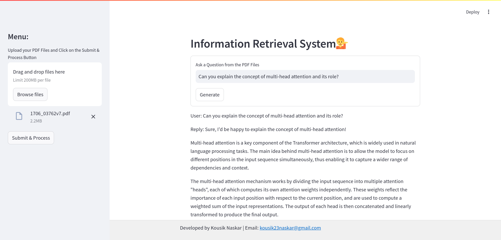

<h1 align="center">🔍 Information Retrieval System 📚</h1> <p align="center">  </p> <p> Welcome to the Information Retrieval System project! This repository contains code and resources for retrieving information from various sources, including uploaded PDF documents, arXiv papers, and Wikipedia. Our goal is to provide an intuitive interface for querying and extracting information effectively. </p>

## Project Overview 💡
This project leverages document embeddings and external data sources to answer user queries. By utilizing techniques such as vector stores and conversational agents, we aim to provide accurate responses and insights based on uploaded documents and reliable online resources.

## Tech Stack Used 🛠️
- **Python**
- **LangChain**
- **Groq (Mixtral)**
- **FAISS**
- **Streamlit**

## Dataset 📊
The system retrieves information from:

- **Uploaded PDF Documents:** Users can upload their own documents for personalized information retrieval.
- **arXiv Papers:** A repository of research papers in various domains.
- **Wikipedia:** A vast source of general knowledge on a wide array of topics.
The project uses these sources to answer user queries while prioritizing information from the uploaded documents when available.

## System Functionality 🧑🏻‍💻
The Information Retrieval System features:

- **File Uploading:** Users can upload PDF documents for context-aware information retrieval.
- **Conversational Interface:** Users can interact with the system by asking questions related to the uploaded content or general knowledge.
- **Fallback Mechanism:** If no PDF is uploaded, the system retrieves information from arXiv or Wikipedia.

## Usage 💪🏻
To run the project locally, follow these steps:

1. **Clone this repository:**
  ```bash
  git clone https://github.com/kousik23naskar/Information_Retrieval_System
  ```
2. **Navigate to the project directory:**
  ```bash
  cd Information_Retrieval_System
  ```
3. **Create a conda environment:**
  ```bash
  conda create -p venv python=3.11 -y
  ```
4. **Activate the environment:**
  ```bash
  conda activate ./venv
  ```
5. **Install the necessary dependencies:**
  ```bash
  pip install -r requirements.txt
  ```
6. **Run the Streamlit app:**
  ```bash
  streamlit run app.py
  ```
7. **Interact with the app:**
- Open your web browser and go to the URL provided by Streamlit (usually `http://localhost:8501`).
- Use the sidebar to upload your PDF documents and click Submit & Process.
- Ask your questions in the input field and click Generate to receive responses.

## Evaluation 📈
While this project does not currently utilize specific metrics for evaluation, the system's effectiveness is assessed based on its ability to provide relevant answers

## Results and Discussion 📊
In this section, we discuss the performance of the Information Retrieval System:

- **Performance**

The system effectively prioritizes responses from user-uploaded PDFs, improving the relevance of the information retrieved.
- **Strengths:**

  - **Versatile Data Sources:** Ability to retrieve information from multiple sources increases the breadth of knowledge.
  - **User-Friendly Interface:** The Streamlit interface provides an easy way to interact with the system without needing technical expertise.
- **Limitations:**

  - **Dependency on Input Quality:** The accuracy of responses heavily depends on relevance of the uploaded documents.
- **Potential Areas of Improvement:**

  - **Enhanced Contextual Understanding:** Improving the model to better understand context and nuances in user queries.
  - **Integration of External APIs:** Adding capabilities to fetch real-time information from external APIs for up-to-date answers.

## Contributing 🤝
We welcome contributions to enhance the project! If you have any suggestions, bug fixes, or new features to add, please submit a pull request. Your contributions are appreciated!

## License 🔐
This project is licensed under the [MIT License](LICENSE).

## Contact 📩
For any questions or inquiries, feel free to reach out to us:
- **Email:** kousik23naskar@gmail.com
- **LinkedIn:** [Kousik Naskar](https://www.linkedin.com/in/dr-kousik-naskar/)

Let’s make information retrieval seamless together!

Thank you for visiting our project repository. Happy querying! 😇